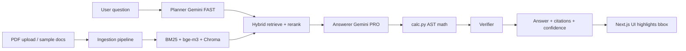

# HNX26PSI01: Multimodal Document Intelligence

Ingest mixed PDFs (text, tables, charts, scans, degraded files) and answer questions with **cited evidence**: document name, page, section, and normalized bounding box for UI highlighting. Chart/table questions use cropped page images and ingestion-time VLM metadata when `GEMINI_API_KEY` is set.

## What it does

1. **Collect** — sample synthetic PDFs under `data/sample_docs` and `data/degraded`, or upload via API/UI.
2. **Process** — repair (when needed), render pages, layout/OCR, table extraction, optional figure VLM (cached by crop hash).
3. **Index** — hybrid retrieval: BAAI/bge-m3 + BM25 + RRF, reranked with bge-reranker-base; ChromaDB local vectors.
4. **Answer** — planner → retrieve → Gemini answerer (with images) → safe math tool → verifier → JSON with claims and citations.



## Technologies

| Layer | Stack |
| --- | --- |
| Backend | Python 3.11, FastAPI, Uvicorn, Pydantic v2 |
| PDF | PyMuPDF, pikepdf (repair fallback), OpenCV, pytesseract (optional OCR) |
| Retrieval | sentence-transformers (bge-m3, bge-reranker-base), rank-bm25, ChromaDB |
| LLM/VLM | google-genai (Gemini free tier), models from `.env` with PRO→FAST→LITE fallback |
| Frontend | Next.js 14, Tailwind CSS, page-image viewer + bbox overlay |
| Eval | `eval/run_eval.py`, 50 gold questions in `data/gold_questions.json` |

Layout uses **PyMuPDF blocks** (Docling not required); see [docs/architecture.md](./docs/architecture.md) for fallbacks.

## Install

**Windows (recommended)**

```powershell
cd multimodal_doc_ai
.\scripts\setup.ps1
```

**Manual**

```powershell
python -m venv .venv
.\.venv\Scripts\pip install -r backend\requirements.txt
copy .env.example .env
# Edit .env: GEMINI_API_KEY=... (required for /ask and demo)

.\.venv\Scripts\python scripts\make_test_pack.py
.\.venv\Scripts\python scripts\ingest_all.py
cd frontend && npm install && cd ..
```

Optional: install [Tesseract OCR](https://github.com/tesseract-ocr/tesseract) for better scanned pages.

## Configure

Copy `.env.example` → `.env`:

- `GEMINI_API_KEY` — from [Google AI Studio](https://aistudio.google.com/apikey)
- `GEMINI_MODEL_PRO`, `GEMINI_MODEL_FAST`, `GEMINI_MODEL_LITE` — default `gemini-3.1-pro-preview`, `gemini-3.8-flash`, `gemini-3.5-flash-lite` (older 2.5 IDs fail for new API keys; client falls back PRO→FAST→LITE on 404/quota)
- `NEXT_PUBLIC_API_URL` — `http://localhost:8000` for the frontend

## Run

**One command (backend + frontend)**

```powershell
.\scripts\start.ps1
```

Then open **http://localhost:3000** (API at **http://localhost:8000/docs**).

**Separate terminals**

```powershell
cd backend
..\.venv\Scripts\uvicorn app.main:app --reload --port 8000

cd frontend
$env:NEXT_PUBLIC_API_URL="http://localhost:8000"
npm run dev
```

**Demo questions (CLI)**

```powershell
.\.venv\Scripts\python scripts\run_demo.py
```

**Tests**

```powershell
.\.venv\Scripts\python -m pytest backend\tests -m "not slow" -q
.\.venv\Scripts\python -m pytest backend\tests\test_retrieval_recall.py -q  # slow, downloads models
```

**Evaluation**

```powershell
# Retrieval only (no API key needed)
.\.venv\Scripts\python eval\run_eval.py --retrieval-only

# Full pipeline (requires GEMINI_API_KEY; use --fast to save quota)
.\.venv\Scripts\python eval\run_eval.py --fast
```

### Measured eval results (retrieval, local run)

From `eval/run_eval.py --retrieval-only` on the 50-question gold set (after `ingest_all.py`):

```
retrieval recall@8: 1.000 (50/50)
```

Full LLM answer/citation scores depend on your `GEMINI_API_KEY` and quota; run `eval/run_eval.py --fast` and commit updated [eval/results.md](./eval/results.md). Do not use fabricated metrics.

### Gemini quota / 429 / 503

Free-tier **Pro** (`GEMINI_MODEL_PRO`) has a separate daily cap. If logs show `limit: 0` for `gemini-3.1-pro` and “retry in … hours”, Pro is exhausted for the day—the client now skips useless Pro retries and falls through to **FAST → LITE**. Transient **503** on Flash also falls back to Lite after backoff.

To keep asking questions without Pro, point Pro at Flash in `.env` (still uses FAST then LITE):

```env
GEMINI_MODEL_PRO=gemini-3.8-flash
GEMINI_MODEL_FAST=gemini-3.8-flash
GEMINI_MODEL_LITE=gemini-3.5-flash-lite
```

Monitor usage: [ai.dev/rate-limit](https://ai.dev/rate-limit).

## Reproduce demo

1. `.\scripts\setup.ps1`
2. Set `GEMINI_API_KEY` in `.env`
3. `.\scripts\start.ps1`
4. In the UI, click the suggested **Q2 vs Q4** question or run `python scripts/run_demo.py`

See [docs/sample_run.md](./docs/sample_run.md) for example request/response shape.

## API

| Method | Path | Description |
| --- | --- | --- |
| GET | `/health` | Status and model IDs |
| GET | `/documents` | Indexed documents |
| POST | `/ingest` | Upload PDF |
| POST | `/ask` | `{ "question", "doc_ids"? }` → structured answer |
| GET | `/page/{doc_id}/{page}` | Page PNG |
| GET | `/element/{element_id}` | Element JSON |
| GET | `/documents/{doc_id}/pdf` | Original PDF |

## Scope note

### MVP (implemented)

- End-to-end ingest → index → ask with citations, bbox, confidence, math tool
- Synthetic test pack + 50 gold questions + eval runner
- Hybrid retrieval + rerank; recall@8 measured on gold pages
- Next.js UI: chat, page viewer with highlights, evidence panel, upload
- Gemini client: cache, backoff, model fallback
- Damaged PDF handled without crash (partial/failed report)

### Stretch (not implemented)

- ColPali / ColQwen page retrieval
- Confidence calibration plots
- Multilingual documents
- Docling layout (PyMuPDF path used instead)
- PaddleOCR second engine (Tesseract optional only)

## License / data

Repository contains **synthetic PDFs only**. No secrets in git — use `.env` (see `.env.example`).

Hackathon brief: [CLAUDE.md](./CLAUDE.md)
