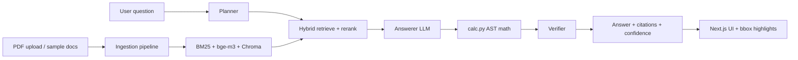

# HNX26PSI01: Multimodal Document Intelligence

A hackathon submission that ingests **mixed PDFs** (text, tables, charts, scans, degraded layouts) and answers natural-language questions with **verifiable citations**: document name, page, section, and normalized bounding boxes for UI highlighting. Chart and table questions use page/crop images plus ingestion-time VLM metadata when an LLM API key is configured.

**Full runbook:** [docs/how-to-run.md](./docs/how-to-run.md) (install, configure, upload your PDFs, reproduce the demo).

## What the project does

1. **Collect** — use bundled synthetic PDFs under `data/sample_docs` and `data/degraded`, or **upload your own PDFs** via the web UI or `POST /ingest`.
2. **Process** — repair when needed, render pages, layout/OCR, table extraction, optional figure/chart VLM (cached by content hash).
3. **Index** — hybrid retrieval: BAAI/bge-m3 dense vectors + BM25 + RRF, reranked with bge-reranker-base; ChromaDB local persistence.
4. **Answer** — planner → retrieve → LLM answerer (with images) → safe AST math tool → verifier → JSON with claims, citations, and confidence.



## Technologies, libraries, and models

| Layer | Stack |
| --- | --- |
| Backend | Python 3.11, FastAPI, Uvicorn, Pydantic v2 |
| PDF | PyMuPDF, pikepdf (repair), OpenCV, pytesseract (optional OCR) |
| Retrieval | sentence-transformers (**BAAI/bge-m3**, **bge-reranker-base**), rank-bm25, ChromaDB |
| LLM/VLM | **NVIDIA NIM** (default) or **Google Gemini** via `LLM_PROVIDER`; model IDs from `.env` with role-based fallback |
| Frontend | Next.js 14 (App Router), Tailwind CSS, page-image viewer + bbox overlay |
| Eval | `eval/run_eval.py`, 50 gold questions in `data/gold_questions.json` |

Layout uses **PyMuPDF blocks** (Docling not required). Details and fallbacks: [docs/architecture.md](./docs/architecture.md).

## Install dependencies

**Windows**

```powershell
cd multimodal_doc_ai
.\scripts\setup.ps1
```

**Manual**

```powershell
python -m venv .venv
.\.venv\Scripts\pip install -r backend\requirements.txt
copy .env.example .env
cd frontend && npm install && cd ..
.\.venv\Scripts\python scripts\make_test_pack.py
.\.venv\Scripts\python scripts\ingest_all.py
```

Optional: install [Tesseract OCR](https://github.com/tesseract-ocr/tesseract) for better scanned pages.

## Configure and run

1. Copy `.env.example` → `.env`.
2. Set **`NVIDIA_API_KEY`** (default provider) or **`GEMINI_API_KEY`** with `LLM_PROVIDER=gemini`.
3. For the UI, prefer the built-in **`/api` proxy** — do **not** set `NEXT_PUBLIC_API_URL` unless you need direct browser→API calls (then set `CORS_ORIGINS` too). See `.env.example`.
4. Start everything:

```powershell
.\scripts\start.ps1
```

- **UI:** http://localhost:3000 — chat, evidence panel, **Upload PDF**, citation highlights  
- **API:** http://localhost:8000/docs  

Separate processes: see [docs/how-to-run.md](./docs/how-to-run.md).

## Upload your own documents

1. Ensure the header shows **API Online**.
2. Click **Upload PDF**, select a file, wait for ingestion/indexing (first run may download embedding weights).
3. The new document appears in the dropdown; ask questions in the chat.

CLI:

```powershell
curl.exe -F "file=@C:\path\to\document.pdf" http://localhost:8000/ingest
```

## How to reproduce the demonstrated results

| Step | Command / action |
| --- | --- |
| 1. Setup + index | `.\scripts\setup.ps1` then `python scripts\ingest_all.py` |
| 2. API key | `NVIDIA_API_KEY` or `GEMINI_API_KEY` in `.env` |
| 3. Start app | `.\scripts\start.ps1` |
| 4. UI demo | Open http://localhost:3000 → run the **Q2 vs Q4 efficiency** suggested question |
| 5. CLI demo | `python scripts\run_demo.py` |
| 6. Metrics | `python eval\run_eval.py --retrieval-only` or `--fast` → `eval/results.md` |

Example `/ask` payload and response shape: [docs/sample_run.md](./docs/sample_run.md).

### Measured eval results (retrieval, local run)

From `eval/run_eval.py --retrieval-only` on the 50-question gold set (after `ingest_all.py`):

```
retrieval recall@8: 1.000 (50/50)
```

Full LLM answer/citation scores depend on your API key and quota; run `eval/run_eval.py --fast` and update [eval/results.md](./eval/results.md). Do not use fabricated metrics.

### LLM quota / errors

Free-tier limits apply per provider. The client retries with backoff and falls back across configured model roles (PRO → FAST → LITE for Gemini; NVIDIA endpoints must be enabled for your key). See [docs/how-to-run.md](./docs/how-to-run.md#6-troubleshooting).

## API

| Method | Path | Description |
| --- | --- | --- |
| GET | `/health` | Status and model IDs |
| GET | `/documents` | Indexed documents |
| POST | `/ingest` | Upload PDF (multipart `file`) |
| POST | `/ask` | `{ "question", "doc_ids"? }` → structured answer |
| GET | `/page/{doc_id}/{page}` | Page PNG |
| GET | `/element/{element_id}` | Element JSON |
| GET | `/documents/{doc_id}/pdf` | Original PDF |

## Scope note

### MVP (implemented)

- End-to-end ingest → index → ask with citations, bbox, confidence, math tool  
- Synthetic test pack + 50 gold questions + eval runner  
- Hybrid retrieval + rerank; recall@8 measured on gold pages  
- Next.js UI: chat, page viewer with highlights, evidence panel, **PDF upload**  
- LLM client: cache, backoff, model fallback  
- Damaged PDF handled without crash (partial/failed report)  

### Stretch (not implemented)

- ColPali / ColQwen page retrieval  
- Confidence calibration plots  
- Multilingual documents  
- Docling layout (PyMuPDF path used instead)  
- PaddleOCR second engine (Tesseract optional only)  

## License / data

Repository contains **synthetic PDFs only** (generated by `scripts/make_test_pack.py`). No secrets in git — use `.env` (see `.env.example`).

Project brief: [CLAUDE.md](./CLAUDE.md)
