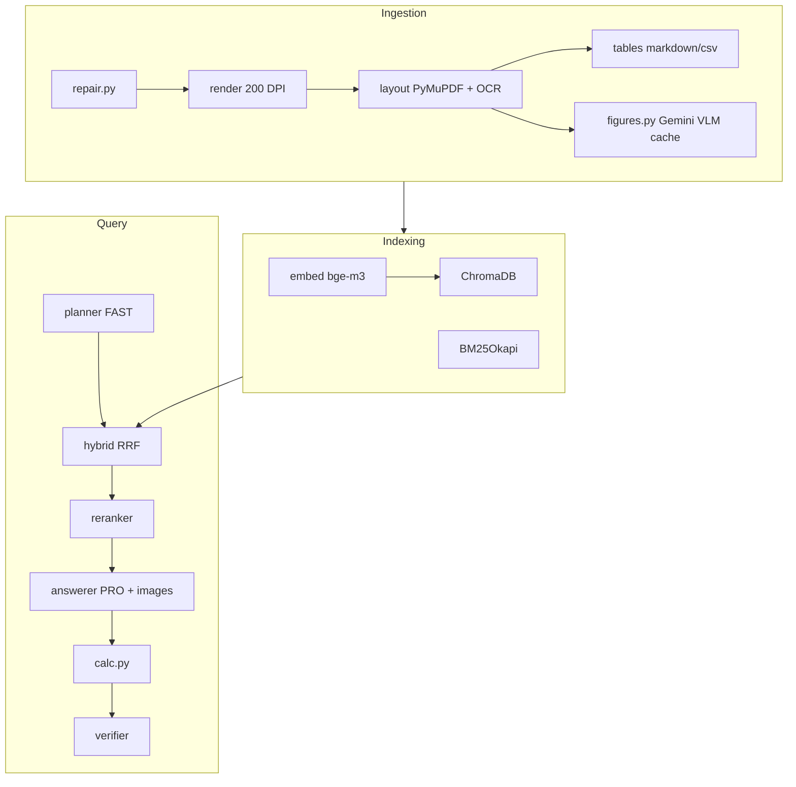

# Architecture

## P0

- Config via `backend/app/config.py` and `.env` (model IDs: `gemini-2.5-pro`, `gemini-2.5-flash`, `gemini-2.5-flash-lite` per [Gemini models docs](https://ai.google.dev/gemini-api/docs/models)).
- `backend/agent/gemini_client.py`: SHA-256 disk cache, exponential backoff with jitter, fallback PRO → FAST → LITE on 429/quota errors.

## P1–P2

- `scripts/make_test_pack.py` + `scripts/test_pack_data.py`: synthetic PDFs and 50 gold questions.
- `backend/ingestion/*`: repair (pikepdf when PyMuPDF fails), render, layout (PyMuPDF + OCR fallback), tables; idempotent cache by SHA-256 under `data/index/`.
- **Repair fallback:** skip pikepdf when PyMuPDF opens cleanly (Windows temp rename issue).

## P3

- Figure VLM hook in `ingestion/figures.py` (Gemini, crop-hash cache; skipped without API key).
- `indexing/`: BAAI/bge-m3 + BM25 + Chroma local; `retrieval/`: RRF hybrid + bge-reranker-base.
- Gate: `test_retrieval_recall.py` prints **recall@8** on gold subset.

## P4

- `tools/calc.py`, `agent/{planner,answerer,verifier,query_pipeline}.py`, `POST /ask` and related API routes in `app/main.py`.
